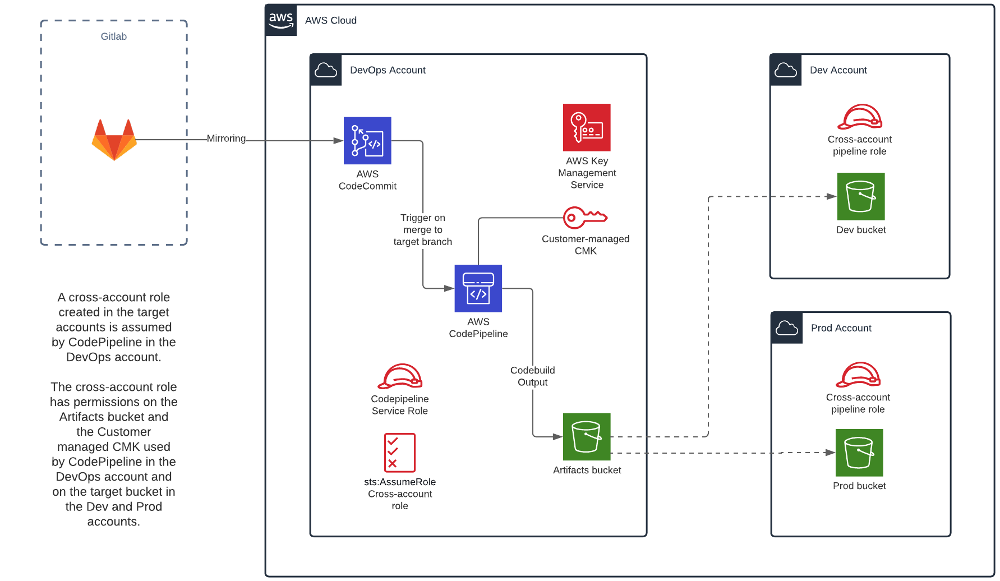
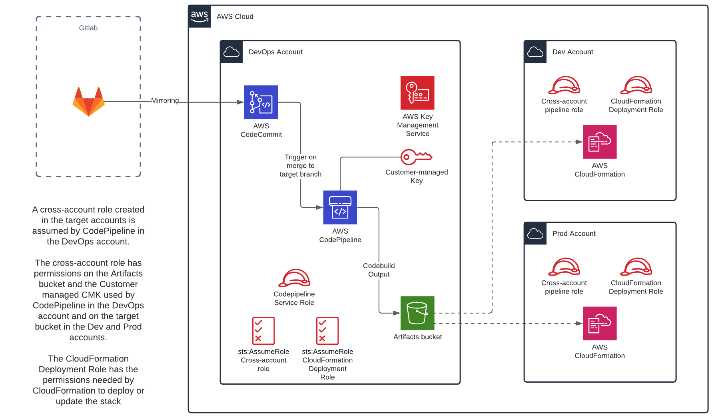

# Cross Account deployment via a DevOps account using AWS CodePipeline & CDK

This is a CDK project designed to facilitate the setup of CodePipeline and supporting infrastructure required to achieve the deployment of a Git repo from a central DevOps account into multiple "environment" accounts (eg, development, staging, production).

This project supports two deployment models:

- Deploy using Cloudformation (eg for SAM and simple\* CDK projects)
- Deploy using S3 (for PWA, SPA etc)

And the following Git providers:

- GitHub
- CodeCommit
- GitLab

If your repo is already in CodeCommit, you can scoot straight to the section [Cross-Account Deployment with CDK](#cross-account-deployment-with-cdk).

If your repo is in GitHub, you will need to get an oauth token and other details to enable that to be set up.

If your repo is in Bitbucket, you will need to add support for that, but as Bitbucket is supported by AWS as a source it should be easy.

If your code is in GitLab, this project has a solution that will allow you to use AWS CodePipeline to deploy it.

### Why not just use GitLab CI/CD?

GitLab CI/CD pipelines run in a GitLab-owned environment and require AWS-account-altering credentials to be stored in GitLab. Choosing instead to deploy using AWS CodePipeline allows you to keep AWS-altering credentials inside your AWS environment while also leveraging the service integrations AWS provides as part of that service.

You can continue to use GitLab CI for executing tests (and the like) as part of your Git workflow, eg to run tests before merges.

---

## If you're using GitLab and you want to deploy using AWS CodePipeline

We're going to use repo mirroring to reflect your GitLab repo into AWS CodeCommit. This is a simple solution and requires minimal permissions to be granted to GitLab.

### Create a mirror repo in CodeCommit

The `create-repo-<repo-name>` stack will allow you to create a CodeCommit repo and IAM user with minimal privileges that can be used to mirror your GitLab repo into CodeCommit.

Run this stack, swapping `<repo-name>` for the name of the CodeCommit repo you want to create. I suggest you use the original repo name with `-mirror` on the end as your CodeCommit repo name, but you can pass whatever name you like (so long as it's a combination of letters, numbers, periods, underscores, and dashes between 1 and 100 characters in length.

The repo and pipeline stacks should be created in your DevOps/Shared Services account, so use a profile here that will deploy to that account. Also, you will want to create the repo in the same AWS region as your deployment pipeline.

```
cdk deploy create-repo-<repo-name> \
    -c repo=<repo-name> \
    -c region=<region> \
    --profile <devops-account-profile>
```

CloudFormation will output some useful items, specifically

- The IAM user you will use to generate Git credentials
- The Git clone URL for http access that you will need to set up in GitLab

> The IAM user has a single inline policy attached to it that only allows the following on the repo you just created:
>
> - codecommit:GitPull
> - codecommit:GitPush

### Get the AWS Git credentials

Once you have the IAM user, go to the IAM console and go to the Security Credentials tab for the user and under the section `HTTPS Git credentials for AWS CodeCommit` click the `Generate Credentials` button.

You can either download the credentials or just copy and paste them into GitLab now (recommended).

### Configuring GitLab

In GitLab, open the repository to be push-mirrored.

Go to `Settings > Repository`, and then expand `Mirroring repositories`. Fill in the Git repository URL field using this format:

```
https://<your_aws_git_userid>@<your_codecommit_repo_http_url>
```

Replace `<your_aws_git_userid>` with the AWS special HTTPS Git user ID from the `HTTPS Git credentials for AWS CodeCommit` created earlier (**NOT** the IAM user name).

Replace `<your_codecommit_repo_http_url>` with the clone URL from CloudFormation.

For Mirror direction, select `Push`.

For Authentication method, select `Password` and fill in the Password field with the password created earlier in `HTTPS Git credentials for AWS CodeCommit`.

The option `Mirror only protected branches` should be chosen for CodeCommit as it pushes more frequently (from every five minutes to every minute). CodePipeline requires individual pipeline setups for named branches you wish to have a AWS CI setup for. Because feature branches that have dynamic names are unsupported, configuring `Mirror only protected branches` doesn’t cause flexibility problems with CodePipeline integration as long as you are also willing to protect all the named branches you want to build CodePipelines for.

Select `Mirror repository`. You should see the mirrored repository appear.

To test mirroring by forcing a push, select the half-circle arrows button (hover text is Update now). If Last successful update shows a date, you have configured mirroring correctly. If it isn’t working correctly, a red error tag appears and shows the error message as hover text.

(adapted from https://docs.gitlab.com/ee/user/project/repository/repository_mirroring.html#setting-up-a-push-mirror-from-gitlab-to-aws-codecommit)

---

# Cross-Account Deployment with CDK

Now you have your code in a supported source repo, let's build our cross-account pipelines!

## About Stack Names and Context variables

Each set of infra is specific to a single repo and branch combination, so all stacks will be named using the model:

```
<base-stack-name>-<reponame>-<branch>
```

You will also need to supply the name of the repo and the branch as context variables to each `deploy` command, like so:

```
cdk deploy base-stack-name-reponame-branch -c repo=<reponame> -c branch=<branch>
```

These context variables will be used when creating resources inside the stacks.

Additional context variables can be specified on the command line to pass additional configuration into the stacks, as needed. For example, unless you are always deploying to your default region, you may need to pass the region you want to create your stack in using `-c region=<region>`.

> This project requires you to use the same region for all the components you build for a given repo. If your code is in CodeCommit and you need to deploy parts of the same repo to different regions you will need to either mirror it to multiple regions or modify this project to enable [cross-region actions](https://docs.aws.amazon.com/codepipeline/latest/userguide/actions-create-cross-region.html). I found cross-region support a bit patchy and (because I didn't need it) I elected to keep things simple by keeping the repo and pipeline components all in the same region.

## Cross-Account Deployment Prerequisites

Before we can achieve cross-account deployments we need to create some infrastructure that will facilitate sharing data and performing operations between accounts - a shared KMS key and some cross-account roles.

### Create the shared KMS key

Firstly we will use KMS to create a customer-managed key (CMK). This will be unique to each distinct repo and branch combination, with the expectation that a single repo and branch combination will be deployed to a single environment account.

> Reminder: you will need to specify any region that is not your default. If you don't specify `region` your default region will be used.

```
cdk deploy create-pipeline-infra-<reponame>-<branch> \
    -c repo=<reponame> \
    -c branch=<branch> \
    -c region=<region> \
    -c target_account_id=<target-account-id> \
    --profile <devops-account-profile>
```

This stack will output the ARN of the CMK key it generates, and it will apply a key policy allowing the target account to use it to decrypt objects as required.

> The ARN of this key will be used in the next stack.

### Create the Cross-Account roles

Now we need to create the role(s) that will be assumed in the target account by CodePipeline and the S3 and CloudFormation deploy actions.

> Note we are deploying this stack into the target account, so use a profile linked to that account, not the DevOps account.
>
> To facilitate enabling of inbound access to the target account from the DevOps account, we are also passing the ID of the DevOps/Shared Services account as a context variable. This will be used to create the needed trust relationships.

There are two ways to build this stack depending on which type of pipeline you are building.

**Option 1. If you are building a CloudFormation pipeline:**

```
cdk deploy create-cross-account-role-<reponame>-<branch> \
    -c repo=<reponame> \
    -c branch=<branch> \
    -c region=<region> \
    -c devops_account_id=<devops-account-id> \
    -c pipeline_key_arn=<pipeline-key-arn> \
    --profile <target-account-profile>
```

This stack will output the ARNs of the two roles it creates, which will be required in the next stack.

**Option 2. If you are building an S3 pipeline:**

We need also to pass the name of the bucket we will write the deployment artifacts to, because the pipeline will need to be granted explicit access to operate on it.

```
cdk deploy create-cross-account-role-<reponame>-<branch> \
    -c repo=<reponame> \
    -c branch=<branch> \
    -c region=<region> \
    -c target_bucket=<target-bucket> \
    -c devops_account_id=<devops-account-id> \
    -c pipeline_key_arn=<pipeline-key-arn> \
    --profile <target-account-profile>
```

This stack will output the ARNs of the role it creates, which will be required in the next stack.

Note you can also pass `-c artifact_bucket=<artifact-bucket-name>` to restrict the role(s) to only be able to access the artifact S3 bucket. We don't require it to be added here because there is a circular dependency between it and the cross-account roles. You can come back later and update this stack to add it if you wish to limit the scope of S3 access in the cross-account roles.

---

## S3 Deployment Pipeline

This pipeline will include an S3Deploy action - see the [example-s3-buildspec.yml](./example-s3-buildspec.yml) file for an example of a simple buildspec that builds and deploys a project using `npm` commands. The buildspec must be called `buildspec.yml` and appear in the root of your Git project. More [info about buildspec.yml](https://docs.aws.amazon.com/codebuild/latest/userguide/build-spec-ref.html).



To create this pipeline, we will deploy an instance of the `s3-create-pipeline` stack.

> This project assumes some other build process has already created the bucket you will be deploying to, as your target bucket will typically have things like CloudFront distributions associated with them, etc.

This stack requires you to pass some additional required context variables:

- The S3 bucket you will deploy to as `-c target_bucket=<deploy-bucket-name>`
- The cross-account role to assume in the target account as `-c cross_account_role_arn=<cross-account-role-arn>`
- A value for build environment, which will be available as `$ENVIRONMENT` in the `buildspec.yml` file: `-c build_env=staging`. This can be used to modify build scripts for dev/staging/production.

Optionally, you can pass a list of approvers which will create a manual approval stage: `-c approvers=<email1,email2>`

The final CLI command should look something like this (assuming no manual approval stage):

```
cdk deploy s3-create-pipeline-<reponame>-<branch> \
    -c target_bucket=<deploy-bucket-name> \
    -c repo=<reponame> \
    -c region=<region> \
    -c branch=<branch> \
    -c build_env=<build-env> \
    -c cross_account_role_arn=<cross-account-role> \
    --profile <devops-account>
```

### Adding a manual approval stage

For deployments into your production environment, add the `approvers` context variable:

```
cdk deploy s3-create-pipeline-<reponame>-<branch> \
    -c target_bucket=<deploy-bucket-name> \
    -c repo=<reponame> \
    -c region=<region> \
    -c branch=<branch> \
    -c build_env=<build-env> \
    -c approvers="guy.morton@versent.com.au,<someone@somewhere.com>" \
    -c cross_account_role_arn=<cross-account-role> \
    --profile <devops-account>
```

This will create the ManualApproval stage and the related SNS topics etc.

### Triggering the pipeline

To trigger the pipeline, merge code changes to the `<branch>` branch of `<reponame>`. You can also run it manually via the CodePipeline console, or via an AWS CLI command:

```
% aws codepipeline start-pipeline-execution --name <pipeline-name> --region <region> --profile <devops-account>
```

---

## CloudFormation Deployment Pipeline

Use this pipeline type if your project build stage outputs CloudFormation, eg you have a SAM or CDK project or other project that deploys via CloudFormation. See the [example-sam-buildspec.yml](./example-sam-buildspec.yml) file for an example of a simple buildspec that builds and deploys a SAM project and [example-cdk-buildspec.yml](./example-cdk-buildspec.yml) file for an example that builds and deploys a CDK project.



The process is similar to the S3 process but we don't need the name of the deployment bucket and instead need the name of the CloudFormation deployment role we created earlier. This is the role that CloudFormation will assume in the target account to deploy your stack.

The final CLI command should look something like this:

```
cdk deploy cf-create-pipeline-<repo-name>-<your-branch> \
    -c repo=<reponame> \
    -c region=<region> \
    -c branch=<branch> \
    -c deployment_role_arn="<deployment-role-arn>" \
    -c cross_account_role_arn="<cross-account-role-arn>" \
    --profile <profile>
```

> This stack will output the name and ARN of the artifact bucket. You can use the name to update the cross-account role stack to narrow its access to S3.

As with the S3 Pipeline, you can add manual approval as a stage before the CloudFormation Execute Change Set stage by adding the `-c approvers="<someone@somewhere.com>"`.

```
cdk deploy cf-create-pipeline-<repo-name>-<your-branch> \
    -c repo=<reponame> \
    -c region=<region> \
    -c branch=<branch> \
    -c approvers="guy.morton@versent.com.au,<someone@somewhere.com>" \
    -c deployment_role_arn="<deployment-role-arn>" \
    -c cross_account_role_arn="<cross-account-role-arn>" \
    --profile <profile>
```

### Triggering the pipeline

To trigger the pipeline, merge code changes to the `<branch>` branch of `<reponame>`. You can also run it manually via the CodePipeline console, or via an AWS CLI command:

```
% aws codepipeline start-pipeline-execution --name <pipeline-name> --region <region> --profile <devops-account>
```

## Refining the deployment permissions

Note that the deployment role created in this project contains a bunch of permissions I have needed for deploying my stacks, but yours may need more permissions, or fewer.

> If you get issues with the deploy pipeline in the target account failing because of missing permissions you can add permissions for the CloudFormation deploy role in the `cross-account-role` stack.

Unfortunately, knowing ahead of time what permissions you will need is an imperfect science. Here are some strategies you might adopt:

**Option 1. Give your deployment role admin access.**

This is not really recommended, because we should be aiming to grant least privilege at all times.

**Option 2. Iterate on failure.**

Run your deployment and parse the errors when it fails to be deployed via CloudFormation. Add the missing permissions iteratively. This can be time consuming and a bit frustrating but it works.

**Option 3. Attempt to calculate the permissions you'll need.**

**For SAM stacks**, you can generate the transformed template using this command:

```
sam validate --debug --profile <profile> |& sed '1,2d' | sed -n -e :a -e '1,3!{P;N;D;};N;ba' > transformed.yaml
```

You can then use https://github.com/iann0036/aws-leastprivilege to extract a policy document that estimates the least privileges that will be required to run your template. This document can be merged with the policy created in this stack.

**For CDK stacks** you can run the same tool over the synthed stack templates generated into cdk.out.

The process of restricting permissions is a bit trial and error, but this should give you a starting point. You may need to iterate deployments and adjust if deployment failures occur when you limit permissions.

---

## Modifying/contributing to this project

Hopefully this project is useful to you, but there are plenty of other scenarios that will have other requirements, so feel free to fork and modify this project to meet your exact requirements.

If you create a pipeline type or make other improvements you are welcome to submit a PR to merge it into this project.

---

## Troubleshooting Checklist

If something is not working, check the following

1. The cross-account role needs permissions to access the artifact bucket
2. The cross-account role needs to trust the devops account to allow it to assume it
3. The deployment role needs to trust the Cloudformation service principal
4. Both roles need to include permissions to access the shared CMK key
5. The CMK needs to have a key policy allowing it to be used by the target account
6. The pipeline role needs to be allowed to assume the roles in the target account

Note that all of the above should be organised for you if you deploy this project as directed.

---

## Generic CDK doco

The `cdk.json` file tells the CDK Toolkit how to execute your app.

This project is set up like a standard Python project. The initialization
process also creates a virtualenv within this project, stored under the .env
directory. To create the virtualenv it assumes that there is a `python3`
(or `python` for Windows) executable in your path with access to the `venv`
package. If for any reason the automatic creation of the virtualenv fails,
you can create the virtualenv manually.

To manually create a virtualenv on MacOS and Linux:

```
$ python3 -m venv .env
```

After the init process completes and the virtualenv is created, you can use the following
step to activate your virtualenv.

```
$ source .env/bin/activate
```

If you are a Windows platform, you would activate the virtualenv like this:

```
% .env\Scripts\activate.bat
```

Once the virtualenv is activated, you can install the required dependencies.

```
$ pip install -r requirements.txt
```

At this point you can now synthesize the CloudFormation template for this code.

```
$ cdk synth
```

To add additional dependencies, for example other CDK libraries, just add
them to your `setup.py` file and rerun the `pip install -r requirements.txt`
command.

## Useful commands

- `cdk ls` list all stacks in the app
- `cdk synth` emits the synthesized CloudFormation template
- `cdk deploy` deploy this stack to your default AWS account/region
- `cdk diff` compare deployed stack with current state
- `cdk docs` open CDK documentation

Enjoy!

---

\* supports CDK projects that synth a standalone template with no external assets
